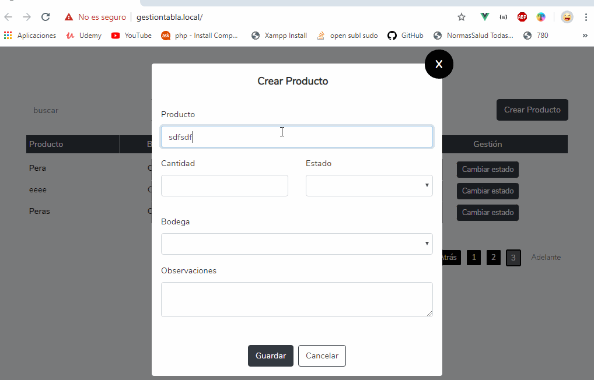

## Intalación del Proyecto

- Clonar
- Instala las dependencias de laravel, recuerda que debes tener tu archivo .env creado
- php artisan composer install
- npm install
- Realiza la migracion php artisan migrate  

Nota: de preferencia puedes utilizar laragon

## License

The Laravel framework is open-sourced software licensed under the [MIT license](https://opensource.org/licenses/MIT).
